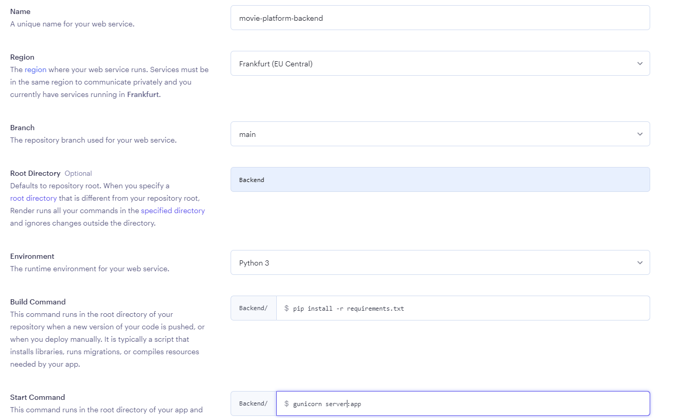
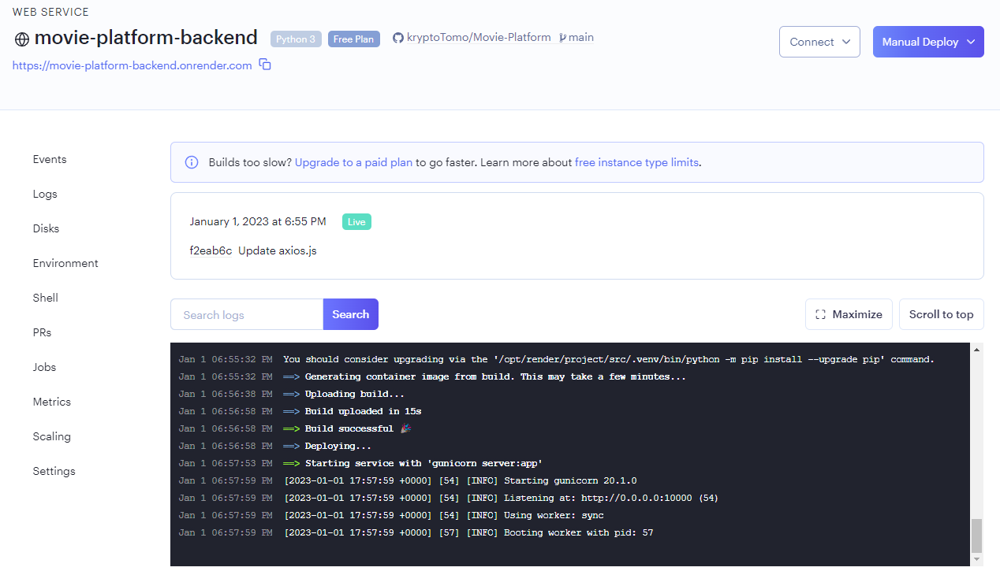
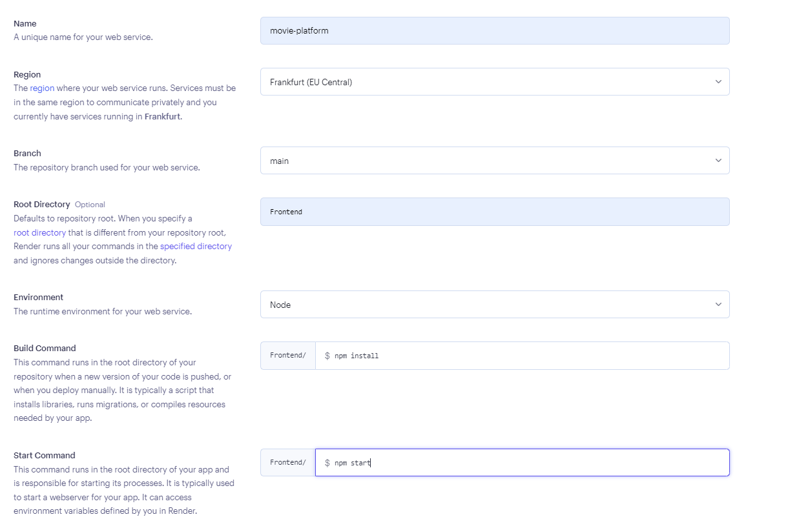
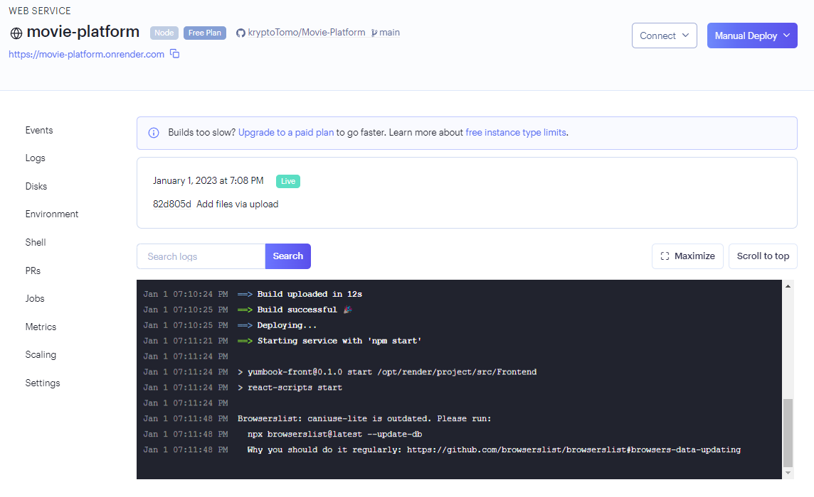

# Movie-Platform

Wstęp
==========================
Celem projektu było stworzenie projektu typu POC(proof of concept) pokazującą zalety wykorzystania grafowej bazy danych. Aplikacja reprezentuje prostą platformę polecającą filmy, w której należy sie zalogwać po czym możemy przeglądać całą bazę, czy też skorzystać z polecanych filmów przez znajomych.

Aplikacja Dostępna pod linkami:
* Link backendu:https://movie-platform-production.up.railway.app/
* Link frontendu:https://movie-platform.onrender.com/

Technologie & biblioteki
==========================

Backend
--------
Po stronie serwera zostały wykorzystane następujące technologie i narzędzia:
* język python3.7,
* biblioteka Flask,
* baza danych Neo4j,
* język zapytań Cypher.

Frontend
--------
Po stronie serwera zostały wykorzystane następujące technologie i narzędzia:
* język JavaScript,
* Node.js,
* axios.

API Serwera
===========

* @app.get('/get-friends') - pobranie znajomych dla konkretnego użytkownia
* @app.get('/get-person') - pobranie lubianych użytkownik
* @app.get('/get-all') - pobiera wszystkich użytkowników
* @app.get('/get-recommendations') - pobiera najbardziej polecane filmy wśród znajomych
* @app.get('/get-credentials') - hasło i login kontra
* @app.post('/get-films') - wyszukanie filmw, z konkretnymi filtrami lub wszystkie
* @app.post('/like') - polubienie filmu
* @app.post('/dislike') - usunięcie polubienia filmu
* @app.post('/create-user') - stworzenie użytkownia
* @app.post('/make-friends') - dodanie znajomego
* @app.post('/delete-friends') - usunięcie znajomego

Baza danych neo4j
=================

Wdrożenie
===========
Przed wdrożeniem aplikacji konieczne jest ustawienie zmiennych łączących z bazą grafową neo4j w backendzie w pliku credentials.py:
* uri - adres URI do bazy danych Neo4j,
* user - nazwa użytkownika do bazy danych Neo4j,
* password - hasło do bazy danych Neo4j.

Wdrożenie backendu:
--------------------

Należy zalogować się na stronę render.com, udostępnić projekt z githuba i uzupełnić w poniższy sposób:

Po prawidłowym wdrożeniu powinniśmy uzyskać wynik taki jak na poniższym zdjęciu.

Wdrożenie frontendu:
--------------------
Na początek należy link URL do backendu, w naszym przypadku: https://movie-platform-backend.onrender.com, należy umieścić ten link w lini https://github.com/kryptoTomo/Movie-Platform/blob/82d805de5cdd653b9bf20eeca90a32364e9259dd/Frontend/src/axios.js#L4

Po tak przygotowanym projekcie możemy przejść do właświego wdrożenia na stronie render.com

Po prawidłowym wdrożeniu powinniśmy uzyskać wynik taki jak na poniższym zdjęciu.

Interfejs Użytkownika
===========

